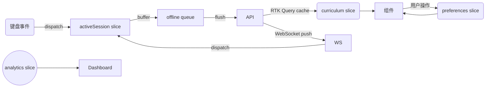

## 阶段 0 · 状态管理与数据流规划

本方案围绕 Blueprint 中“Redux 风格单向数据流、离线同步、WebSocket 实时更新”的要求，为后续阶段确定统一的前端状态管理与数据同步基础。

### 1. 技术选型

| 模块 | 方案 | 说明 |
| --- | --- | --- |
| 全局状态 | Redux Toolkit + RTK Query | 官方支持、不可变数据、内置中间件，方便接入 WebSocket/队列 |
| 本地缓存 | Redux Persist + IndexedDB | 覆盖 offline 模式需求，局部 slice 可自定义存储策略 |
| 网络请求 | RTK Query + 自定义 Base Query | 统一处理 REST/GraphQL；可扩展到 WebSocket streaming |
| Undo/Redo | `redux-undo` 或自定义 history middleware | 保留 50 步操作历史；关键 slice（lesson builder、settings）启用 |
| 队列同步 | 自定义离线队列中间件 | 将离线期间的 `TypingEvent`、`SettingsPatch` 排队，恢复网络后批量同步 |
| WebSocket | Socket.IO / native WS 封装为 RTK Query Streaming | 支持实时课程进度、教师监控、多人竞速 |

### 2. Store 切片结构 (草案)

```
root
├── user: UserProfile + auth 状态
├── preferences: UserPreferences + UI state
├── curriculum: lesson/track 元数据（可由 RTK Query cache）
├── sessions:
│   ├── activeSession: TypingSession runtime state
│   └── history: 最近 N 次完成的摘要
├── analytics: 热力图、趋势、成就进度（按需加载）
├── classroom: 教师/管理员相关数据（仅特定角色）
├── connectivity: 网络状态、离线队列、同步状态
└── ui: Modal/Sheet 状态、加载指示等
```

### 3. 数据流概述

1. **初始化**：
   - 加载用户偏好与本地持久化的 session 数据；
   - 请求 `curriculum` 基础数据（可分批按 Track 获取）。

2. **用户操作**：
   - 打字事件 → `sessions/activeSession` slice 记录（仅 volatile）；
   - 达到采样阈值（例如每 250ms 或 10 次按键）后写入 IndexedDB，用于断线恢复；
   - 同时通过自定义 middleware 将事件压入 `connectivity.offlineQueue`。

3. **服务器同步**：
   - 在线状态下：middleware 将事件批量上报后端 API，更新 RTK Query cache；
   - 离线状态下：事件留在 queue，UI 显示“离线”提示；
   - 恢复联网：`connectivity` slice 触发重新同步（promise queue + 重试策略）。

4. **WebSocket**：
   - 当用户加入实时课堂或竞速模式时，开启 WS channel；
   - 中间件将 WS 推送映射为 Redux action（如 `sessions/updatePeerProgress`）。

5. **Undo/Redo**：
   - 对“课程编辑器”“设置面板”等支持撤销；
   - `activeSession` 不记录撤销，以免影响实时性。

### 4. 模块间协作



### 5. Offline / Undo 关键点

- Queue 中每条记录包含：`type`, `payload`, `timestamp`, `retryCount`。
- 保持 50 步撤销历史，最旧记录自动出队，避免内存膨胀。
- IndexedDB 以 session + chunk 维度存储 `typing-events`，提升读取性能。

### 6. 后续扩展

- 阶段 1：实现 `sessions/activeSession` slice 与基本事件流（无离线队列）。
- 阶段 2-3：引入 preferences 持久化、Undo/Redo、音频/布局设置。
- 阶段 4：接入后端 API、IndexedDB、离线队列与 WebSocket。
- 阶段 5：扩展 classroom slice，与教师端逻辑结合。

此文档将在后续阶段不断补充，实际代码实现会拆分到 `store/`、`slices/`、`services/` 等目录中。

